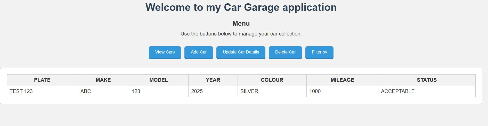
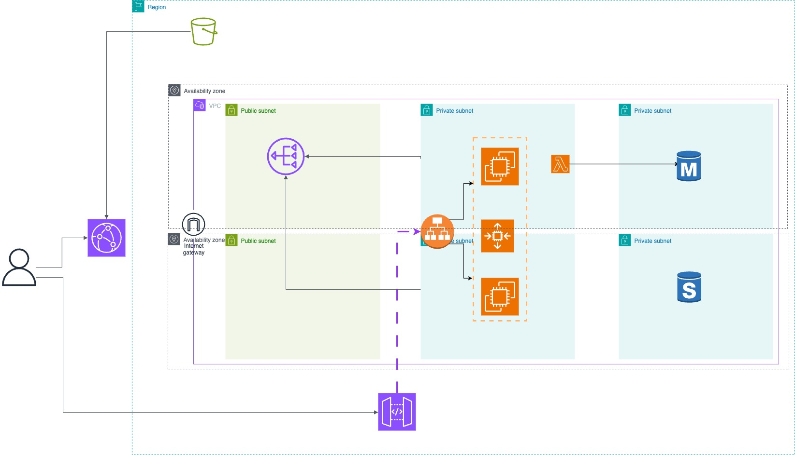

# carApp-project  
#### A Basic CRUD Project Utilizing AWS Services 
The goal of this project is to practice with an array of AWS services and not to deploy this application in the most efficient way. Some security best practices have been followed (e.g. utilizing security groups, database secret, IAM DB authentication, rate limiting on the API gateway) but there is no authentication/authorization required to use the application after it is launched

## User stories  

Users can perform the following actions:
1. View all cars in the collection
2. Add a car in the collection
3. Update car details
4. Delete a car from the collection
5. Filter cars by attribute

## High Level Architecture  

- Static webpage files are delivered to users via CloudFront 
- User sends API calls to perform the various actions
- An API Gateway receives the API calls and forwards them to ALB
- Application hosted in EC2 instances processes the requests
- Database hosts a table with the car collection

## Technologies

The following stack is used:
- **Frontend**: HTML, CSS, Javascript
- **Backend**: Python (Flask, gunicorn) and PostgreSQL

### Infrastructure
| AWS Service | Use |
|-------------|-----|
|*S3*|Storing static webpage files|
|*CloudFront*|Distributing static webpage to users|
|*API Gateway*|Receive API calls from users through webpage and forwards them to ALB|
|*Application Load Balancer*|Receive API calls from API Gateway and forward them to EC2 instances|
|*Auto Scaling Groups*|EC2 instances added and removed as per capacity requirements|
|*RDS*|Hosting the PostgreSQL database instance|
|*Lambda*|Used alongside custom resource to initialize the database|
|*CloudWatch*|Logging of Lambda invocations|
|*NAT Gateway*|Providing internet access to EC2 instances and Lambda within private subnet|
|*Cloudformation*|Defining all the infrastructure in YAML|

### Database schema

The database consists of only one table:
- **Plate**: Text (primary key)
- **Make**: Text
- **Model**: Text
- **Year**: Number
- **Colour**: Text
- **Mileage**: Number
- **Status**: Text

### Deployment

*Requirements*: AWS CLI v2 installed, AWS user/role with admin permissions for the above services, AWS credentials configured
1. Clone the repo locally and run `deployement.sh`
2. Once it finishes navigate to AWS console and enable CloudFront distribution manually
3. Navigate to the URL generated by CloudFront and use the application
4. Once not needed run `cleanup.sh` to delete all resources